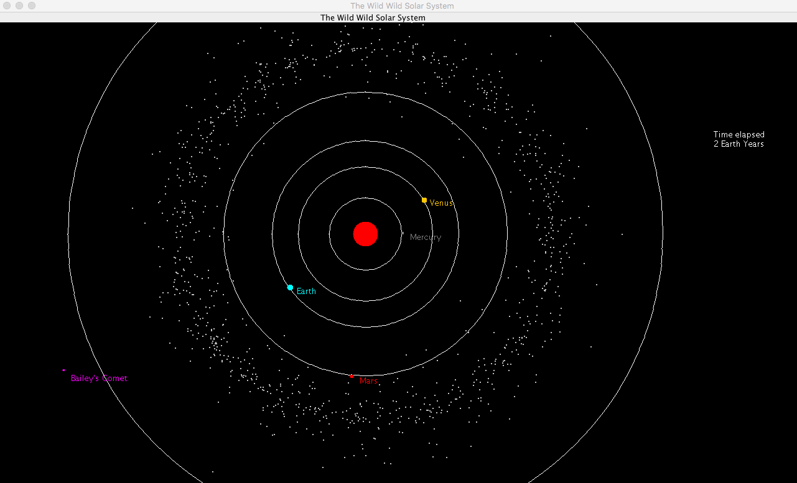

# Solar-System-Simulation

Solar System Simulation Java Applet 



## Getting Started

### Prerequisites

Ensure you have [Java](https://java.com/en/download/) installed on your computer. 

**Maven** - Download from [here](https://maven.apache.org/install.html) and follow the [installation guide](https://maven.apache.org/install.html) to install it on your system.
Alternatively, if you use [homebrew](https://brew.sh/), simply install using the following command

```
brew install maven
```

### Installing

```
git clone https://github.com/crabdul/Solar-System-Simulation.git
cd Solar-System-Simulation
mvn clean install 
```

### Running the Applet

```
java -jar target/SolarSystemSimulation-1.0.jar
```

## Built With

* [Java](https://java.com/en/download/)
* [Maven](https://maven.apache.org/) - Dependency Management

## Author

* **Karim El Khazaani** - [crabdul](https://github.com/crabdul)

## License

This project is licensed under the MIT License
